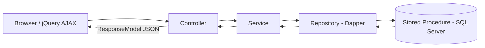
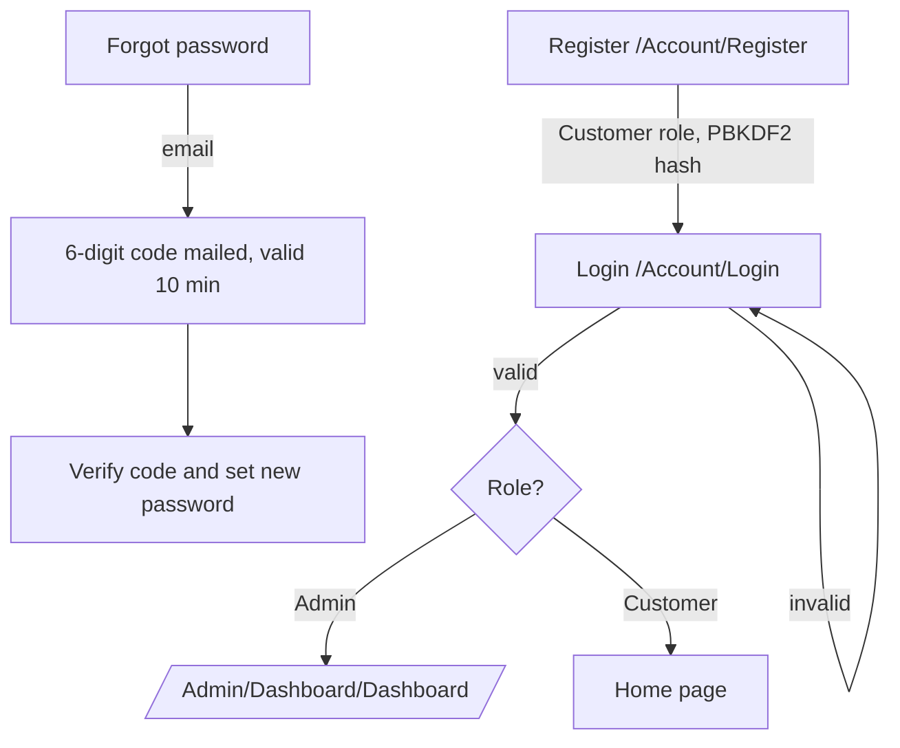
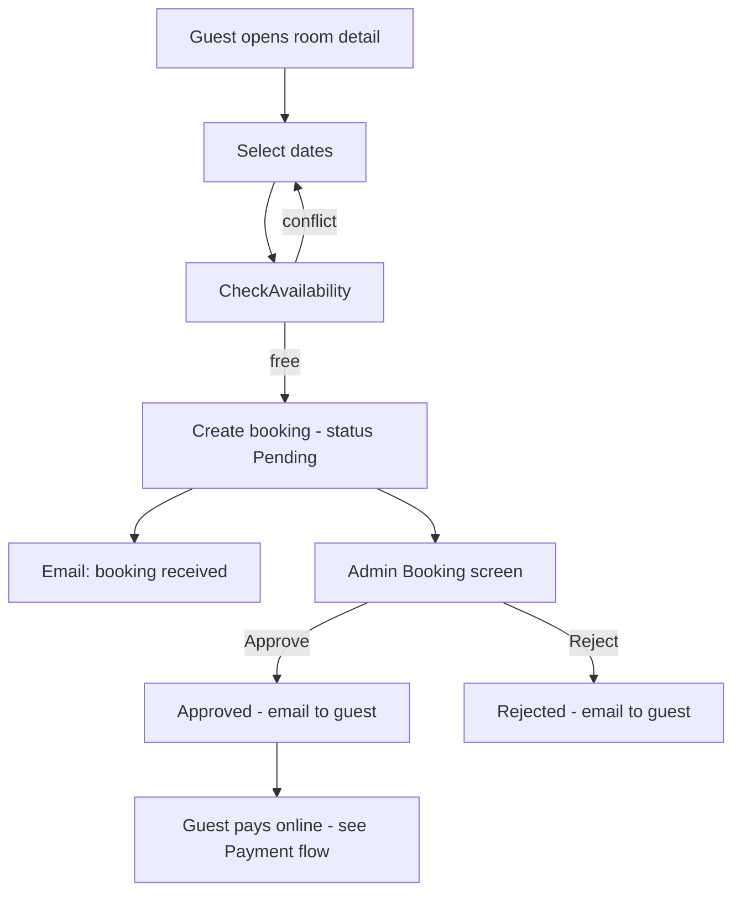
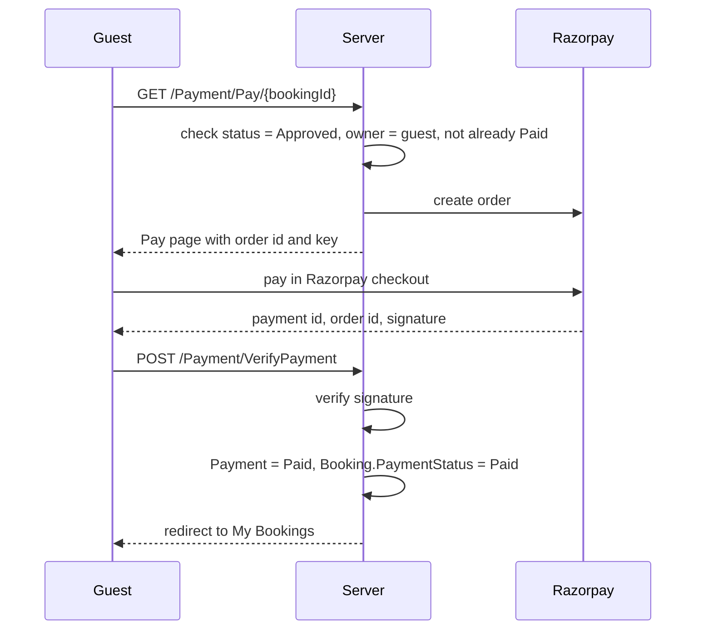
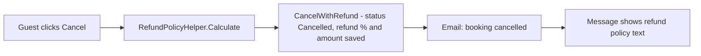
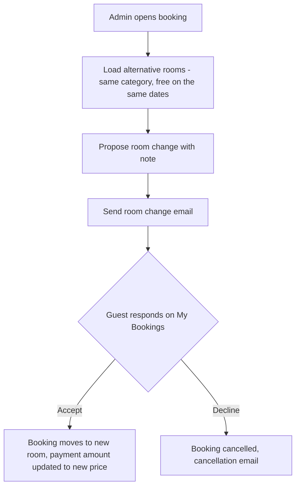
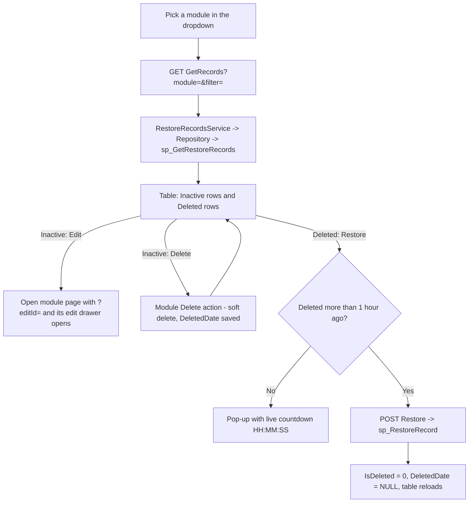

# Royal Paradise Hotel — Dynamic Hotel Booking CMS

A dynamic **ASP.NET Core MVC (.NET 8)** hotel booking website with a custom **Admin CMS Panel**, built with
**Dapper + SQL Server**, **jQuery/AJAX** and a **Controller → Service → Repository → Stored Procedure** architecture.

Every section of the public site (sliders, About content, Why Choose Us, Rooms, Gallery, Facilities, Navbar, Footer,
Social links, Site settings) is editable from the Admin Panel. Guests can register, book a room, pay online with
Razorpay, cancel with an automatic refund calculation and receive email notifications and reminders.

**Contents:** [Tech stack](#1-tech-stack) · [Structure](#2-project-structure) · [Setup](#3-database-setup) ·
[Run](#4-running-the-project) · [Architecture flow](#5-architecture-and-request-flow) ·
[Auth flow](#6-authentication-flow) · [Booking flow](#7-booking-flow) · [Payment flow](#8-payment-flow) ·
[Cancel & refund](#9-cancellation-and-refund-flow) · [Room change](#10-room-change-flow) ·
[Reminders](#11-reminder-flow) · [Admin modules](#12-admin-modules) · [Slider order](#13-slider-display-order-flow) ·
[Restore Records](#14-restore-records-flow) · [Notes](#15-notes-and-known-simplifications)

---

## 1. Tech Stack

| Layer          | Technology                                               |
|----------------|----------------------------------------------------------|
| Framework      | ASP.NET Core MVC (.NET 8)                                |
| Data access    | Dapper + Stored Procedures (`Microsoft.Data.SqlClient`)  |
| Database       | Microsoft SQL Server                                     |
| Frontend       | Razor Views, jQuery, AJAX                                |
| Auth           | Cookie authentication (Role claim: `Admin` / `Customer`) |
| Payments       | Razorpay (order + signature verification)                |
| Email          | SMTP (`EmailSettings`)                                   |
| Background job | `BookingReminderWorker` (hosted service)                 |
| Alerts (Admin) | SweetAlert2                                              |
| Passwords      | PBKDF2 (`Rfc2898DeriveBytes`)                            |

---

## 2. Project Structure

```
CMS_HotelBooking/
├── Areas/Admin/
│   ├── Controllers/        # One controller per admin module (JSON endpoints)
│   └── Views/              # Table + drawer UI per module, Shared/ layout and sidebar
├── Controllers/            # Public site: Home, About, Room, Gallery, Contact, Booking, Account, Payment
├── Data/                   # IDbConnectionFactory
├── Filters/                # RestoreRestrictionFilter (not used by Restore Records any more)
├── Helpers/                # PasswordHelper, FileUploadHelper, EmailSettings, RefundPolicyHelper
├── Models/                 # POCOs mapped to SQL tables (+ RestoreRecord, ResponseModel)
├── ViewModels/
├── Repository/             # BaseRepository + Interfaces/ + Implementations/  (Dapper + SPs)
├── Services/               # Interfaces/ + Implementations/ + Background/BookingReminderWorker
├── ViewComponents/         # Navbar and Footer components
├── Views/                  # Public Razor views (Home, About, Room, Gallery, Contact, Account, Booking, Payment)
├── wwwroot/
│   ├── css, js, images     # Original static-site assets
│   ├── uploads/            # Admin-uploaded images
│   └── Admin/css, Admin/js # Admin styling + one JS file per module
├── Program.cs              # DI registration, auth, admin auto-seed, background worker
└── appsettings.json        # Connection string, EmailSettings, Razorpay
```

---

## 3. Database Setup

1. In SQL Server Management Studio run **`script.sql`** (tables and stored procedures).
2. Run **`RestoreRecords_AllInOne.sql`** on the same database. It is safe to run more than once and does five things:
   1. adds `DeletedDate` to Room, RoomCategory, Amenity, Gallery, Facility, Slider, MenuMaster and SocialMedia,
   2. re-numbers Slider `DisplayOrder` as 1, 2, 3 inside every page,
   3. re-creates the 8 `sp_Delete*` procedures (soft delete + delete time, with `TRY/CATCH` and transaction),
   4. creates `sp_GetRestoreRecords`,
   5. creates `sp_RestoreRecord`.
3. Update `appsettings.json`:

```json
"ConnectionStrings": {
  "DefaultConnection": "Server=.;Database=<YourDb>;Trusted_Connection=True;TrustServerCertificate=True;MultipleActiveResultSets=true"
},
"EmailSettings": { "SmtpHost": "", "SmtpPort": 587, "EnableSsl": true, "SenderEmail": "", "SenderPassword": "", "SenderName": "", "IsEnabled": false },
"Razorpay": { "KeyId": "", "KeySecret": "", "Currency": "INR" }
```

> Never commit real SMTP passwords or Razorpay secrets. Use User Secrets or environment variables.
> With `EmailSettings.IsEnabled = false` no mail is sent.

---

## 4. Running the Project

```bash
cd CMS_HotelBooking
dotnet restore
dotnet run
```

On first start the app creates a default Admin user if none exists.

| Role     | Email                          | Password  |
|----------|--------------------------------|-----------|
| Admin    | admin@royalparadise.com        | Admin@123 |
| Customer | register at `/Account/Register` | —        |

Admin panel: `/Admin/Dashboard/Dashboard`. Change the default password before production.
Registration always creates a Customer; there is no public way to create an Admin.

---

## 5. Architecture and Request Flow

Every feature uses the same layers. A controller never talks to the database directly.



Typical admin module (e.g. Amenity):

1. Page `/Admin/Amenity/Amenity` loads the Razor view; `Amenity.js` calls `GetAll` with `$.ajax`.
2. **Add / Edit** opens the slide-out drawer. `Save` posts the form (with image upload through `FileUploadHelper`).
3. The controller validates, calls the service, the service calls the repository, the repository runs the stored procedure.
4. The controller returns `ResponseModel { success, message, data }` and SweetAlert2 shows the result.
5. **Delete** is a *soft delete* (`IsDeleted = 1`); nothing is removed from the table.

**Dynamic navbar and footer:** `NavbarViewComponent` and `FooterViewComponent` read the Navbar, Footer, Social Media and
Site Setting tables and render on every public page, so admin changes show up everywhere without touching views.

---

## 6. Authentication Flow



- A cookie is issued with `NameIdentifier`, `Email` and `Role` claims. Admin controllers use `[Authorize(Roles = "Admin")]`.
- Booking and Payment controllers use `[Authorize]`; a guest is redirected to `/Account/Login`.
- Wrong role -> `/Account/AccessDenied`.

---

## 7. Booking Flow

Statuses: **Pending -> Approved / Rejected -> Cancelled**.



Rules in `BookingService.CreateAsync`:
- check-out must be after check-in, maximum **60 nights**;
- the room must exist and be `IsAvailable`;
- the room must have no overlapping booking for those dates;
- `TotalPrice = nights x PricePerNight`;
- a confirmation email is sent and its status is stored on the booking.

Only an Admin can approve or reject. Admin can also see payment details and use the **Booking Calendar** view.

---

## 8. Payment Flow

Only an **Approved** booking of the logged-in guest can be paid.



Payment statuses: `Pending`, `Paid`, `Failed`, `Refunded`. An already paid booking cannot be paid again.

---

## 9. Cancellation and Refund Flow

A guest can cancel from **My Bookings** unless the booking is already `Cancelled` or `Rejected`.

| Time before check-in | Refund |
|----------------------|--------|
| 48 hours or more     | 100%   |
| 24 to 48 hours       | 50%    |
| under 24 hours       | 0%     |



Admin can also set a booking to `Cancelled`, which sends the same cancellation email.

---

## 10. Room Change Flow

Used when the booked room cannot be given to the guest.



The proposed room must be in the **same category**, and must have **no conflict** for the booking dates.
Only a `Pending` room-change request can be answered.

---

## 11. Reminder Flow

`BookingReminderWorker` starts with the app, runs once immediately and then **every hour**.
`BookingReminderService` sends a reminder email at **24 hours, 12 hours and 6 hours** before check-in
(check-in time is taken as 11:00 on the check-in date). Each reminder type is stored in `BookingReminder`
and is sent only once; a failed email is logged and tried again at the next hourly run inside the same hour window.

---

## 12. Admin Modules

Dashboard, Home (Welcome, Why Choose Us), About (Page, Story, Reception, CTA, Counter Box), Room, Room Category,
Amenity, Gallery, Facility, Slider, Booking, Booking Calendar, Feedback, Contact Messages, Navbar, Footer,
Social Media, Site Setting, Users, Restore Records.

Most modules follow one pattern: a Razor view (table + drawer form), `wwwroot/Admin/js/{Module}.js` doing CRUD with
`$.ajax`, and a controller with `GetAll`, `GetById`, `Save`, `Delete` returning `ResponseModel` JSON.

- **Rooms:** cover image, gallery images, and amenities kept as a comma-separated `AmenityIds` list.
- **Guest feedback:** saved as unapproved; it appears in the site testimonials only after an Admin approves it.
- **Contact messages:** submitted from the Contact page and read in the Admin panel.

---

## 13. Slider Display Order Flow

Sliders belong to a page (`PageKey`: Home, Room, About, Gallery, Contact). `DisplayOrder` runs **1, 2, 3 ...
separately inside each page**.

- **Add:** the new slider gets `max(order of that page) + 1`. The form does not send an order.
- **Edit:** the order stays the same. If the slider is moved to another page it gets the next number of that page.
- **Delete:** `sp_DeleteSlider` re-numbers the remaining sliders of that page, so there is no gap.
- **Restore:** `sp_RestoreRecord` re-numbers again, so the restored slider is placed in sequence.

---

## 14. Restore Records Flow

Admin -> **Restore Records** lists only **Inactive** and **Deleted** records (filter: All / Inactive / Deleted) for
10 modules: Counter Box, Rooms, Why Choose Us, Room Category, Amenity, Gallery, Facility, Slider, Navbar, Social Media.

| Record state | Actions (icon buttons)                              |
|--------------|-----------------------------------------------------|
| Inactive     | **Edit** (opens that module's edit drawer), **Delete** |
| Deleted      | **Restore** only                                    |



**1-hour lock**
- `sp_GetRestoreRecords` returns `RemainingSeconds` for every deleted row (calculated on the SQL Server clock).
- The Restore button shows the countdown pop-up while `RemainingSeconds > 0`.
- `sp_RestoreRecord` checks the same rule, so the lock cannot be skipped from the browser. If it is still locked it returns `0`
  and the message *"This record can be restored only after 1 hour."* is shown.
- Records deleted before `DeletedDate` existed have no delete time and can be restored immediately.

**Side effects on restore**
- Rooms: its images are restored too.
- Counter Box, Why Choose Us and Slider: `DisplayOrder` is re-sequenced.

**Files:** `RestoreRecordsController`, `IRestoreRecordsService` / `RestoreRecordsService`,
`IRestoreRecordsRepository` / `RestoreRecordsRepository`, `Models/RestoreRecord.cs`, `sp_GetRestoreRecords`,
`sp_RestoreRecord`, `Areas/Admin/Views/RestoreRecords/RestoreRecords.cshtml`, `wwwroot/Admin/js/RestoreRecords.js`.

**Adding another module**
1. Add the `DeletedDate` column and a delete procedure that saves `DeletedDate = GETDATE()`.
2. In `RestoreRecords_AllInOne.sql` add a `-- Module: <name>` block to `sp_GetRestoreRecords` and to `sp_RestoreRecord`.
3. Add an entry to `restoreModules` in `RestoreRecords.js` (controller name and columns) and an option in the dropdown of `RestoreRecords.cshtml`.
4. If the module needs a column that `Models/RestoreRecord.cs` does not have, add it there.
5. The module's page must open its edit drawer for `?editId=` (this is handled once for every page in `AdminLayout.js`, it only needs a global `edit(id)` function).

---

## 15. Notes and Known Simplifications

- Room amenities are stored as a comma-separated list on the `Room` row instead of a join table.
- Restore Records covers the 10 modules above only; Booking, Users, Feedback and Contact Messages have no restore.
- `Filters/RestoreRestrictionFilter.cs` is left from an earlier version and is not used by Restore Records; it can be removed together with its line in `Program.cs`.
- Change the default Admin password and keep SMTP / Razorpay secrets out of source control.